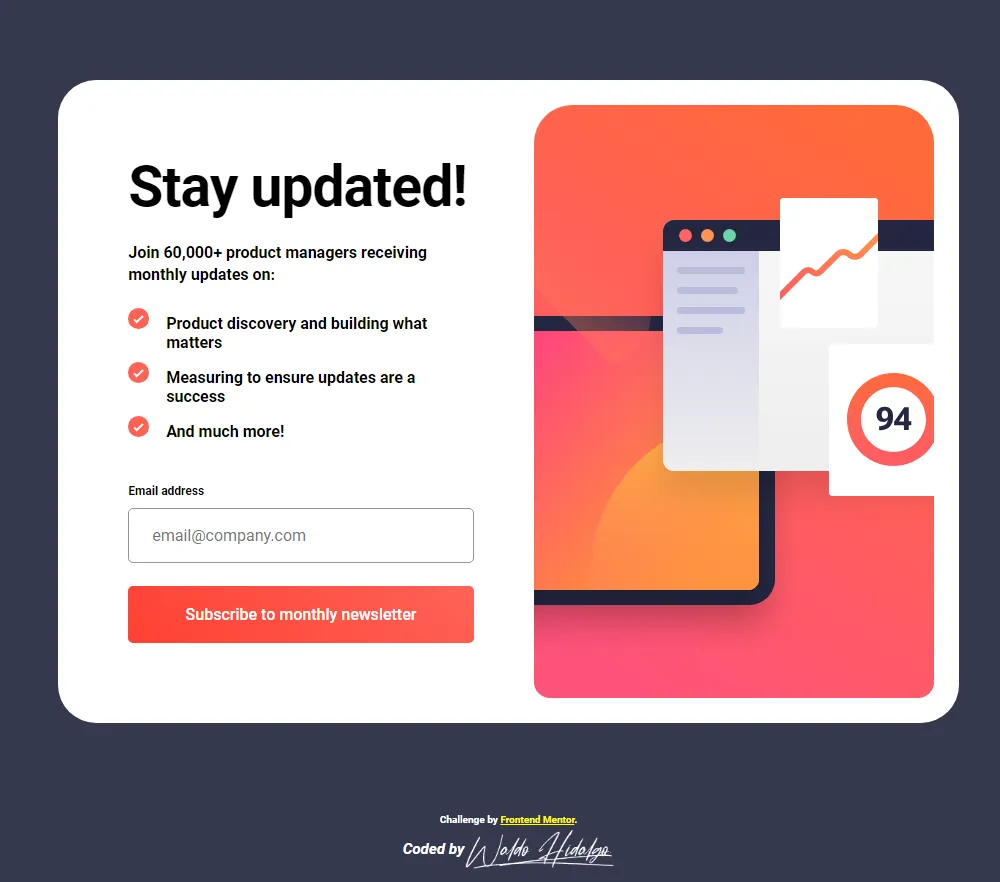
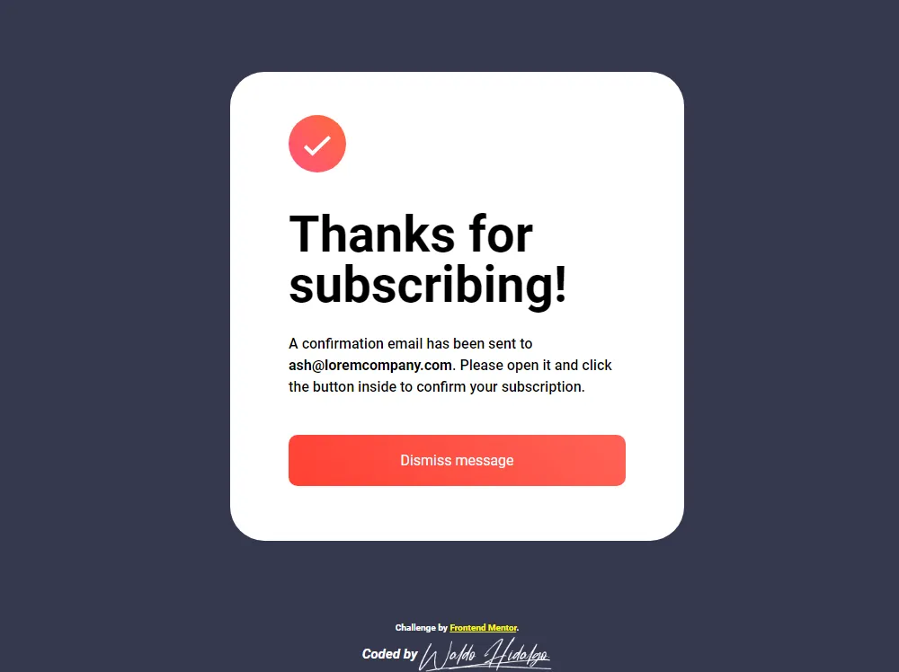
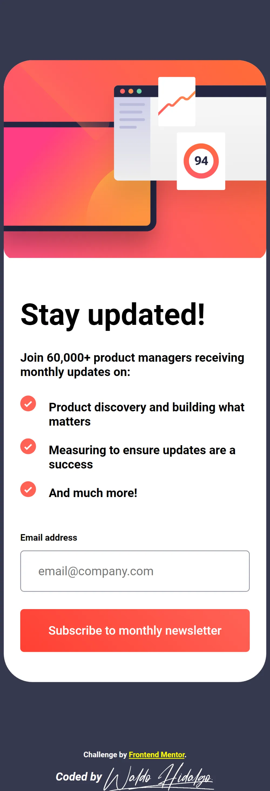
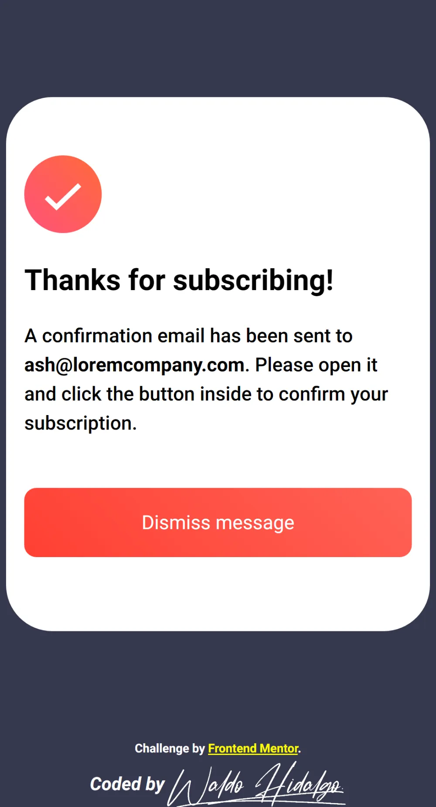

# Frontend Mentor - Newsletter sign-up form with success message solution

Esta es el repositorio con el código solución al challenge [Newsletter sign-up form with success message challenge on Frontend Mentor](https://www.frontendmentor.io/challenges/newsletter-signup-form-with-success-message-3FC1AZbNrv).

Las tecnologías utilizadas fueron:

## The challenge

El desafío consiste en que los Users should be able to:

- Add their email and submit the form
- See a success message with their email after successfully submitting the form
- See form validation messages if:
  - The field is left empty
  - The email address is not formatted correctly
- View the optimal layout for the interface depending on their device's screen size
- See hover and focus states for all interactive elements on the page

## Screenshot

A continuación presento screenshot del proyecto en pantallas desktop y mobile junto con la pantalla de success en desktop y mobile screen así mismo muestro los estados.

### Screenshot Desktop

### Screenshot Error

### Screenshot Success

### Screenshot Mobile

### Screenshot Mobile Success

#### Links

- Live Site URL: [https://waldohidalgo.github.io/proyecto_5_sign_up_form_frontendmentor](https://waldohidalgo.github.io/proyecto_5_sign_up_form_frontendmentor)
